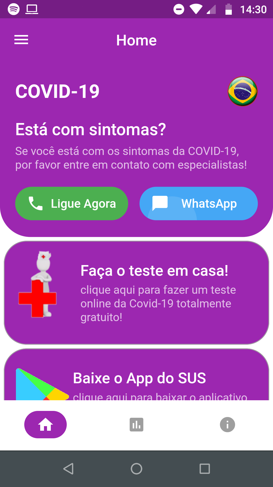
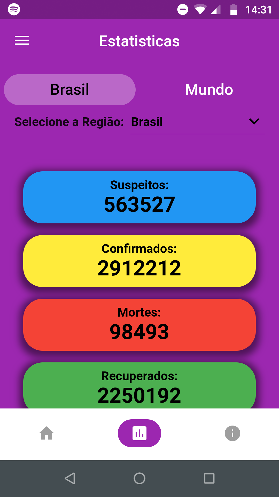
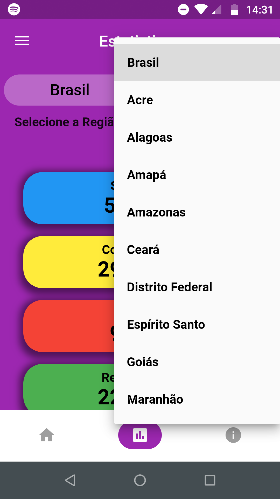
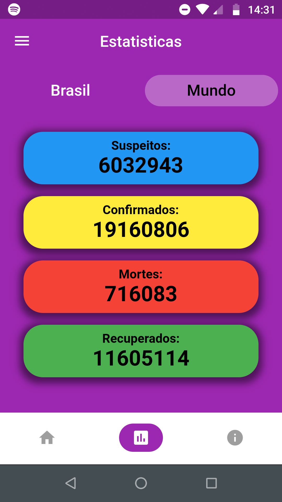
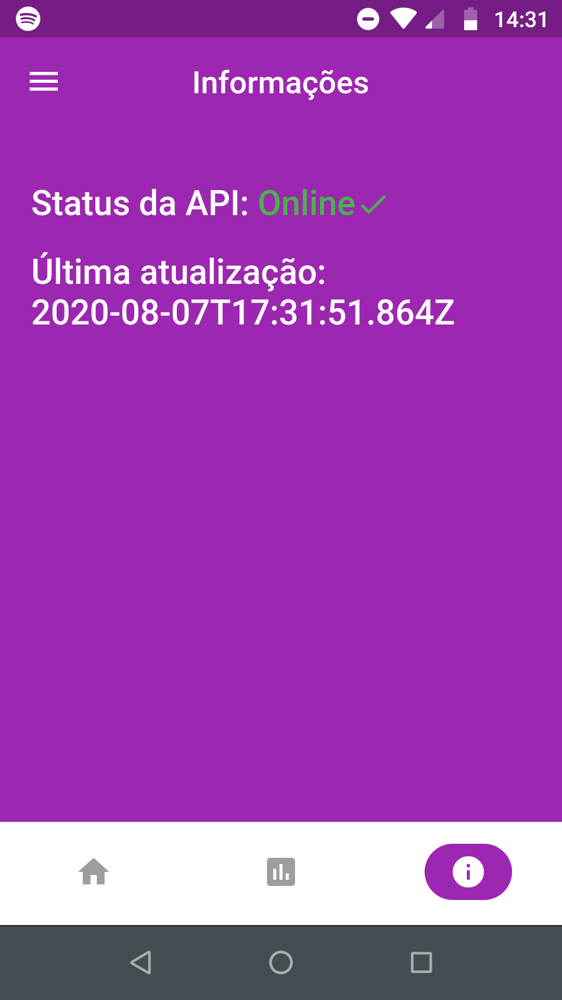

# 😷 Covid-19 Info 
Repository for project Covid-19 Info APP

# 🔖 Description
The application has the function of helping the user to access the media of the Brazilian federation to stay informed and protected from Covid-19, in addition to taking online tests for a possible infection by the disease. The application also has data taken from a public API to show the user about the disease in Brazil and in the world.

# 🚀 Technologies
The application was full developed using flutter.

# 📱 Screenshots

# Main Screen
Main screen that grants access to the federation's media and an online test of the disease.

# Statistics Screen
Statistics screen where it is possible to see disease data throughout Brazil or in a specific state and in worldwide.

  
  
  

# Api Status Screen

## 💻 Getting Started

This project is a starting point for a Flutter application.

A few resources to get you started if this is your first Flutter project:

- [Lab: Write your first Flutter app](https://flutter.dev/docs/get-started/codelab)
- [Cookbook: Useful Flutter samples](https://flutter.dev/docs/cookbook)

For help getting started with Flutter, view our
[online documentation](https://flutter.dev/docs), which offers tutorials,
samples, guidance on mobile development, and a full API reference.

## 📝 License

Esse projeto está sob a licença MIT. Veja o arquivo [LICENSE](LICENSE.md) para mais detalhes.
